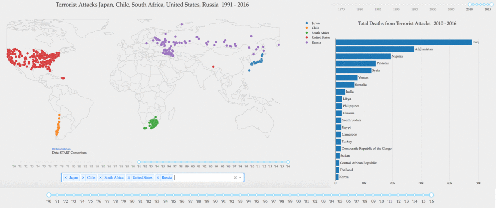

# Global Terrorism Database Interactive Dashboard

Explore the live dashboard [here](https://goo.gl/sxYD1y).

## Overview

This interactive dashboard provides a comprehensive visualization of the Global Terrorism Database. The dataset is sourced from the National Consortium for the Study of Terrorism and Responses to Terrorism (START), and it offers valuable insights into global terrorism trends.

## Technologies Used

- Programming Language: Python
- Packages:
  - Plotly: Charts and data visualization
  - Plotly's Dash: Interactivity
  - Pandas: Data frame handling and processing
  - Heroku: Hosting / app management

## How to Use

Watch this quick video to see how the dashboard works and the features available:

## Data Source

The dataset is obtained from the Global Terrorism Database, provided by the National Consortium for the Study of Terrorism and Responses to Terrorism (START). It contains a wealth of information about terrorist incidents worldwide.

For more details and to access the dataset, visit [this link](https://www.start.umd.edu/gtd).

*Note: The dashboard is hosted on Heroku, offering a seamless user experience.*

Enjoy exploring the data and gaining valuable insights into global terrorism trends using this interactive dashboard!
